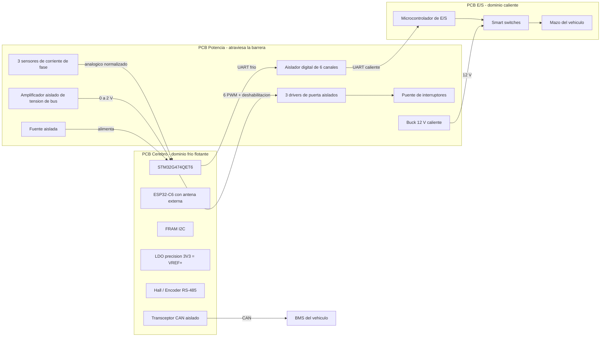

# Arquitectura

## 1. Idea central

Tres PCBs con papeles bien separados, y **una sola barrera de aislamiento galvanico** cuyo hardware esta concentrado enteramente en la PCB de Potencia. Eso deja la PCB Cerebro completamente en el lado frio y la PCB de E/S completamente en el lado caliente, sin que ninguna de las dos tenga que saber que existe una barrera.

| PCB | Dominio | Papel | Varia entre vehiculos |
|---|---|---|---|
| **Cerebro** | Frio (flotante) | Habla con el motor y con el exterior: FOC, sensores de posicion, Bluetooth, CAN | No |
| **Potencia** | Atraviesa la barrera | Puente, drivers, sensores de corriente y tension, alimentaciones. Base mecanica | Si |
| **E/S** | Caliente (negativo de bateria) | Habla con el mazo del vehiculo: interruptores, acelerador, luces, bocina | Si |

## 2. Dominios electricos

- **Dominio frio (flotante)**: la PCB Cerebro completa. Se alimenta desde un secundario aislado generado en la PCB de Potencia. Su masa **no** esta unida al negativo de bateria.
- **Dominio caliente (referido al negativo de bateria)**: puente de interruptores, lado de salida de los drivers de puerta, rail de 12 V de cargas, y la PCB de E/S completa.
- **PCB Potencia**: unica placa que atraviesa la barrera.

### Excepcion documentada

El transceptor **CAN hacia el BMS reside en el Cerebro y es aislado**. No es realmente una excepcion sino buena practica: un bus que sale al exterior del equipo deberia ir aislado siempre.

### Advertencia mecanica

Si la PCB Cerebro se monta sobre separadores metalicos atornillados al chasis, **el aislamiento se pierde por los tornillos**. Los separadores deben ser aislantes o el montaje debe estar aislado.

## 3. Diagrama de dominios

## 4. Cruces de la barrera (lista cerrada)

Cada cruce cuesta dinero y añade un modo de fallo, asi que la lista esta deliberadamente cerrada.

| Señal | Mecanismo de cruce | Notas |
|---|---|---|
| 6 PWM y deshabilitacion | Integrado en los drivers de puerta aislados | La barrera esta dentro del propio driver |
| Fallo de driver | Salida del lado frio del propio driver | Llega al Cerebro sin aislador adicional |
| 3 corrientes de fase | El sensor de efecto Hall integrado **es** la barrera | Conductor primario caliente, salida analogica fria |
| Tension de bus | Amplificador aislado | Divisor en el lado caliente |
| Temperaturas (NTC) | Aislamiento **fisico**, no electronico | NTC aislada del circuito de potencia, señal directa al lado frio |
| Enlace con la PCB E/S | Aislador digital de 6 canales | TX, RX, NRST, BOOT0, APAGADO_SALIDAS, y un canal de reserva |
| CAN hacia el BMS | Transceptor CAN aislado, en el Cerebro | Bus externo, aislado por principio |

## 5. Contrato entre placas

Es lo que hace posible la modularidad. Estas reglas son invariantes de la plataforma y **no deben romperse** al diseñar una PCB de Potencia o de E/S nueva.

### 5.1 Señales normalizadas

- **Corriente de fase**: salida ratiometrica, 0 A en VREF/2, fondo de escala en la corriente nominal de esa placa de Potencia. El Cerebro lee en tanto por uno y no necesita saber que sensor hay debajo. Esto es lo que permite que la placa de 48 V use un sensor integrado de mas/menos 30 A y la de 500 A use un sensor sin nucleo sobre un busbar, con el mismo firmware.
- **Tension de bus**: 2,0 V corresponde a la tension maxima nominal de esa placa. El Cerebro lee en tanto por uno.
- Los sensores de corriente y el amplificador aislado **se alimentan del mismo LDO de precision que genera VREF+**, de forma que los errores de la referencia se cancelen por ser ambos ratiometricos.

### 5.2 Identificacion de placas

- **PCB Potencia**: 4 pines del conector, cada uno unido a masa o dejado al aire, forman un codigo de 16 familias. Cuesta unas pistas de cobre y ningun componente. Es un **enclavamiento de seguridad**: el firmware se niega a habilitar el puente si el codigo cableado no coincide con el tipo de placa configurado desde la app. Sin el, nada impediria accionar una placa de 48 V con la escala de corriente de una de 144 V, y el primer pulso de PWM se la llevaria por delante.
- **PCB E/S**: se identifica por **autodescripcion** sobre el enlace UART, no por hardware. Al arrancar declara su tipo, revision, numero de serie y las tablas de sus entradas y salidas. El Cerebro lo reenvia a la app, que construye su interfaz en consecuencia.

### 5.3 Parametros declarados por cada PCB de Potencia

Cada placa de Potencia debe documentar, en su `hardware/potencia/notas.md`:

- Corriente de fondo de escala del sensor de corriente.
- Tension maxima de bus (la que corresponde a 2,0 V).
- **Retardo de propagacion de sus drivers de puerta**, necesario para calibrar el tiempo muerto.
- Coeficientes de las NTC.
- Codigo de identificacion cableado.

## 6. Reparto de responsabilidades

### 6.1 El Cerebro habla con el motor

Sensores Hall, encoder, PWM, corrientes, y las comunicaciones hacia el exterior. **No tiene ninguna entrada ni salida del mazo del vehiculo.** Es lo que lo hace invariante.

### 6.2 La E/S habla con el mazo

Interruptores del manillar, acelerador, luces y bocina. Como en el vehiculo real esas señales retornan por el chasis, que es el negativo de bateria, el dominio caliente es su sitio natural: alli no necesitan ningun componente de aislamiento.

Lleva un microcontrolador propio, pequeño y determinista. **No es el ESP32**, deliberadamente: poner el mando de par detras de un SoC con pila de radio, en la placa que mas veces se va a rediseñar y que ademas conmuta 3 A de faro, era un mal negocio por seguridad, por radiofrecuencia y porque dejaria al Cerebro sin Bluetooth ni actualizacion por aire cuando no hubiera placa de E/S.

### 6.3 La Potencia sostiene la barrera

Y ademas es la base mecanica: se atornilla al disipador y sobre ella se montan las otras dos.

## 7. Cadena de actualizacion por aire

El ESP32-C6 descarga la imagen completa en su propia flash y verifica su integridad **antes** de tocar el STM32, de modo que una conexion cortada a mitad no deje el driver inutilizable. El STM32 aprovecha el doble banco *read-while-write* del G474 para un esquema A/B con vuelta atras. El microcontrolador de la E/S se reprograma con su cargador de arranque de fabrica, invocado por el STM32 mediante las lineas NRST y BOOT0, lo que permite rescatarlo aunque su firmware este corrupto.
